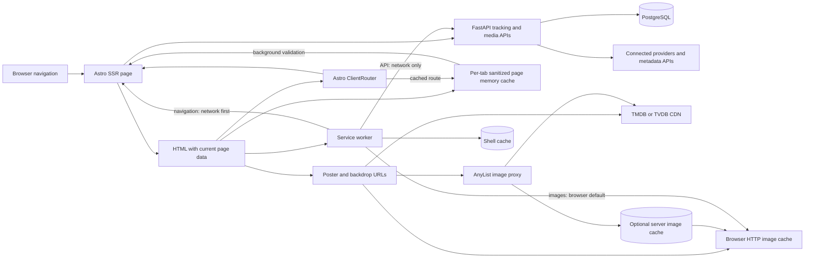

# Stage Two Astro performance and cache report

Date observed: 2026-09-21

This report records the public behavior that was observable from AniList's list page and maps it to AnyList's current Astro implementation. It does not infer AniList's authenticated editor, offline behavior, server cache, or private API internals.

## Public AniList comparison

Observed page: `https://anilist.co/user/antipixel/animelist`

The browser was Chromium at a 1440 x 900 viewport. The profile was public and signed out. A consent dialog was present. The measurements below are a single warm-profile reload and are diagnostic evidence rather than a benchmark.

| Observation | Evidence | Practical reading |
| --- | --- | --- |
| The list data arrived with the document | The 123,339 byte decoded HTML contained the visible list groups and 316-item count. No `graphql` resource appeared in the Resource Timing API or the captured reload requests. | The public list can paint useful content without waiting for a separate list-data request. This says nothing about authenticated edits or subsequent private requests. |
| Cover art loaded progressively | 58 AniList CDN cover URLs appeared as image or CSS-initiated resources while the visible document contained only three ordinary `img` elements. | AniList uses background images for list covers and allows later rows to fill after the text and table structure are usable. |
| The browser reused cached cover assets | The warm-profile resource timing entries for AniList CDN covers reported zero transfer bytes even though reload requests were visible. | Stable cover URLs benefit from the browser HTTP cache. Zero transfer bytes cannot be treated as a cold-load image cost. |
| Route assets were prefetched | The document declared seven prefetches for route CSS or JavaScript, including list, forum, stats, settings, staff, and submissions assets. Main and vendor CSS were preloaded. | AniList spends background network and cache space to reduce later route latency. The broad prefetch set is observable; its triggering policy is not. |
| No service worker controlled the page | `navigator.serviceWorker.controller` was `null`, and Cache Storage returned no cache names. | Offline behavior and any server-side cache remain unknown. Browser HTTP caching was still active. |
| The reload included substantial third-party work | The initial observation recorded 185 resources and about 2.51 MB decoded resource bytes. The reload recorded 161 resources, about 174 KB transferred by Resource Timing and about 2.51 MB decoded, with advertising, consent, font, and analytics hosts represented. | Request count and decoded work are affected heavily by third parties and the consent state. They are context for the comparison, not a target for AnyList. |
| The warm reload made useful HTML available quickly in this environment | Navigation timing reported response end at 409 ms, DOM content loaded at 430 ms, and load at 971 ms. | This is one run on one network and machine. It supports the loading-path analysis only; it is not a reproducible field performance result. |

## AnyList request and cache paths

### Page HTML and data

AnyList uses Astro's server output. Route frontmatter reads FastAPI before returning HTML, so a direct navigation contains the current page data and can render without a second client request for its main content. The authenticated app bar concurrently reads preferences, recent events, and the current profile for every server-rendered route.

`ClientRouter` converts eligible links into client navigations. Astro prefetch is enabled by default when `ClientRouter` is present, according to the current [Astro prefetch guide](https://docs.astro.build/en/guides/prefetch/#using-with-view-transitions). AnyList does not currently override that configuration.

The navigation runtime retains sanitized HTML for selected low-risk routes in memory. It is scoped to the signed-in user and the current tab, with limits of 18 pages, 2 MB per page, and 10 MB total. A retained page opens immediately and is validated from the network in the background for the next visit. Credentials, settings, admin, authentication, and arbitrary routes are excluded. This cache disappears when the tab closes, the identity changes, or logout begins.

Astro server response caching is not configured. The current `astro.config.mjs` has no cache provider or route rules, and authenticated HTML does not declare a shared-cache policy. This is the safe current behavior for user-specific pages. Astro 6 does support explicit server caching through a provider and `routeRules`, as described in the [Astro configuration reference](https://docs.astro.build/en/reference/configuration-reference/#cache).

### API and provider data

Browser API calls use `/api/proxy/*`. The proxy streams FastAPI responses and forwards cache headers when FastAPI supplies them. Tracking and library JSON have no client data cache in the service worker and are fetched from the network. Browse search cancels the previous request and waits 280 ms after typing, which bounds wasted request and render work during fast input.

FastAPI remains responsible for database and provider access. This report does not assign a browser cache to backend values merely because the HTML page cache can retain a rendered snapshot.

### Posters and backdrops

Normal tracker cards request explicit TMDB sizes instead of `original` assets:

| Surface | Current size |
| --- | --- |
| Search suggestions and compact list rows | `w92` |
| List cards and compact rating targets | `w185` |
| Browse, profile grids, activity, and editor poster | `w342` |
| Title poster and history poster | `w500` |
| Episode stills | `w780` |
| Title/editor backdrops | `w1280` |

Most card images use lazy loading. Stable CDN URLs let the native browser HTTP cache reuse the same size and path across pages. AnyList does not currently emit `srcset` or `sizes`, so the chosen component size is the only candidate the browser receives.

The service worker deliberately bypasses TMDB, the AnyList image proxy, and rating-poster routes. The optional FastAPI image cache stores TMDB and TVDB bytes by size and path, returns cached files with `Cache-Control: public, max-age=31536000, immutable`, and prunes least-recently-used on-demand images before collected artwork when the configured limit is exceeded. Rating posters use a one-day browser lifetime; their fallback redirect uses one hour.

### Browser and service worker

The service worker has one `media-tracker-shell-v4` Cache Storage bucket. It preloads only `offline.html`, keeps fetched static assets as an offline fallback, bypasses all API requests, and uses network-first navigation. Images stay in the browser's normal HTTP cache. Non-GET writes are never queued.

A warm local development sample of `/browse` produced 97,013 decoded document bytes and 48 resource entries. Twenty `w342` posters were browser-cache hits with zero recorded transfer bytes. The service worker controlled the page and exposed only the shell cache. Development Vite modules account for most of that sample's 605,678 decoded script bytes, so those script figures do not represent the production bundle.

The largest production client artifacts in the current build are the stats route script at about 210 KB, the connections route script at about 116 KB, and global CSS at about 98 KB before transport compression. Astro route splitting keeps those route scripts away from unrelated first visits, but the stats route remains the largest client CPU and parse candidate.

## CPU, memory, and network cost summary

| Layer | CPU | Memory or disk | Network |
| --- | --- | --- | --- |
| Astro SSR | Serializes complete page HTML and runs route plus app bar reads. | No configured Astro response cache. | One HTML response includes primary page data. |
| ClientRouter | Parses fetched HTML, swaps documents, and re-runs route scripts. | Small router runtime plus the bounded per-tab page cache. | Prefetch and each validation can request HTML before or after navigation. |
| Per-tab page cache | Sanitizes and parses retained documents. | Hard cap of 10 MB and 18 pages; cleared with the tab or identity. | A cached visit still validates online in the background. |
| API proxy | Primarily streams responses. | No service-worker JSON storage. | Current data always crosses the local frontend/backend boundary. |
| Posters | Decode and paint dominate client image CPU. | Browser HTTP cache; optional bounded server disk cache. | Explicit TMDB widths reduce bytes; repeated paths and sizes reuse cache entries. |
| Service worker | Runs a small fetch strategy for same-origin GETs. | One shell cache plus `offline.html` and previously fetched static assets. | Network first means online page and shell requests still reach the server. |

## Major findings and proposed improvements

### Major: repeated authenticated app bar reads

Every authenticated SSR route asks FastAPI for preferences, recent events, and profile data. Pages such as Home also ask for preferences and recent events in their own route load, so one navigation can duplicate those reads. Cached navigation validation repeats the whole SSR path as well.

Proposed improvement: load a single bounded app-shell payload in middleware or a shared request-scoped loader and pass it to both the route and app bar. Keep user-specific HTML private. This removes duplicate database work and local HTTP round trips without introducing cross-user caching.

### Major: poster candidates are fixed per component

Explicit widths are a substantial improvement over original-size images, but grid cards always request `w342` even when their rendered width is much smaller. A narrow phone and a wide desktop receive the same candidate, while high-density displays cannot select a sharper candidate where it would help.

Proposed improvement: emit TMDB `srcset` candidates with truthful `sizes` for grid and detail posters, retaining the current fixed URL as `src`. Use the same proxy choice for every candidate when the optional server image cache is enabled. Measure actual CDN bytes and visual quality before changing the size table.

No critical issue was observed in the current page, data, image, browser-cache, or service-worker paths.

## Verification boundaries

- AniList observations cover the public signed-out list page only.
- Resource Timing transfer sizes are browser estimates and include warm-cache zeros.
- The AnyList browser sample used the local Astro development server and disposable local data.
- Production bundle sizes are uncompressed file sizes from the current build output.
- Field Core Web Vitals require a deployed origin and real traffic; they were not inferred from these local runs.
