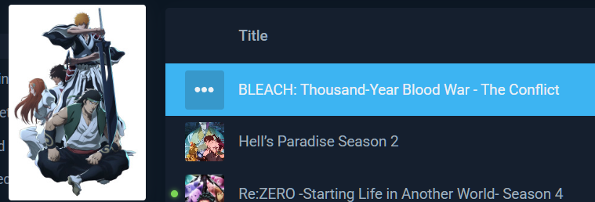
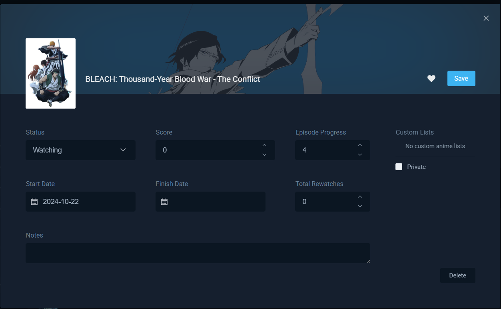
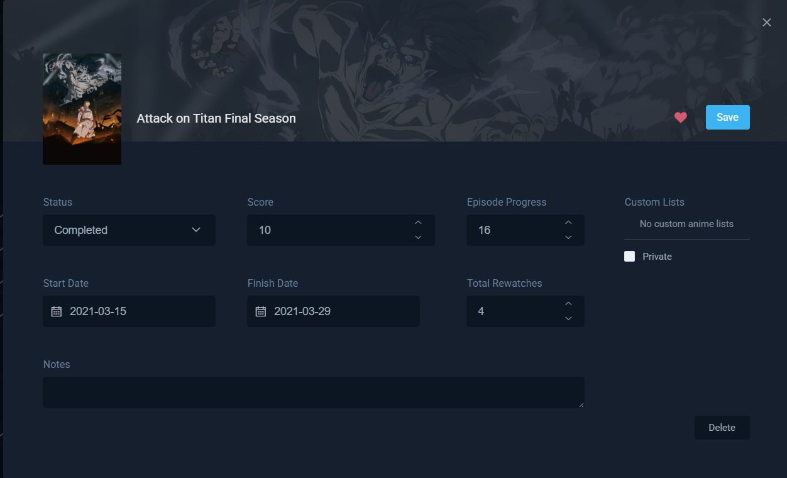
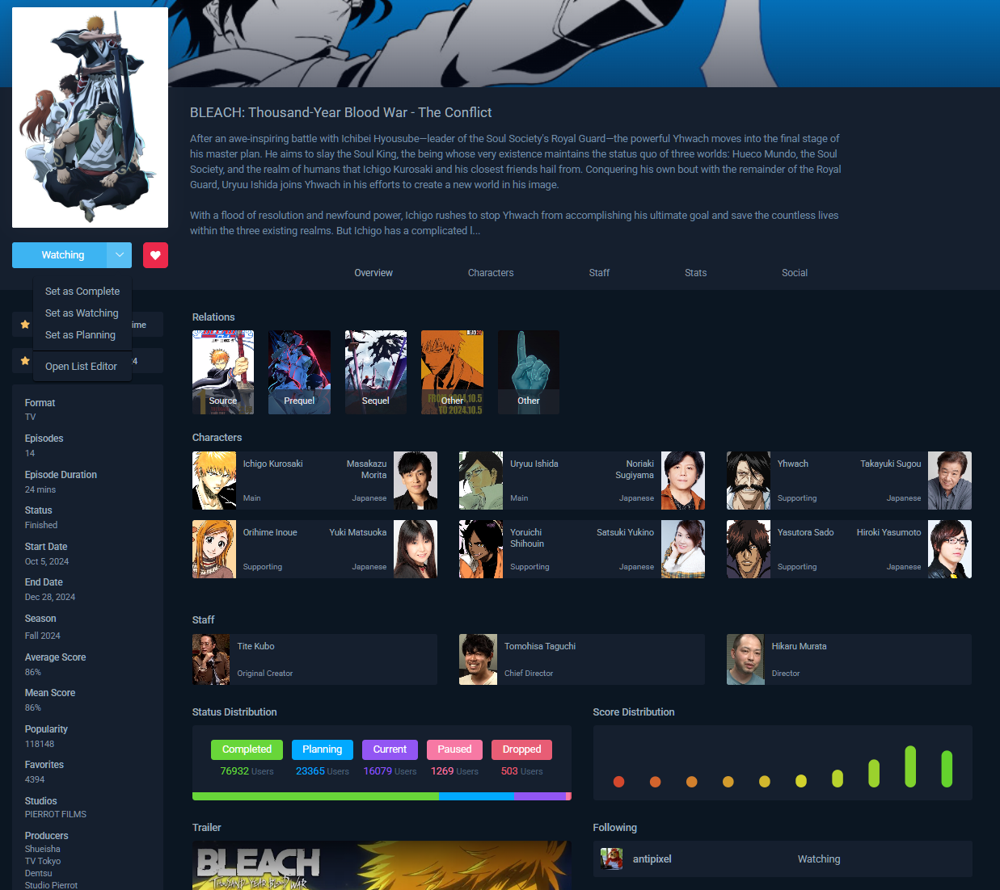
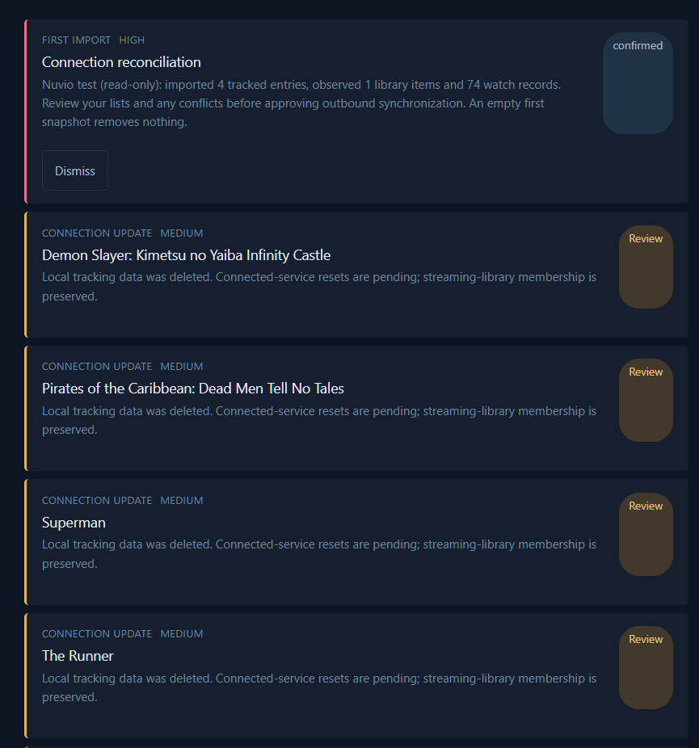
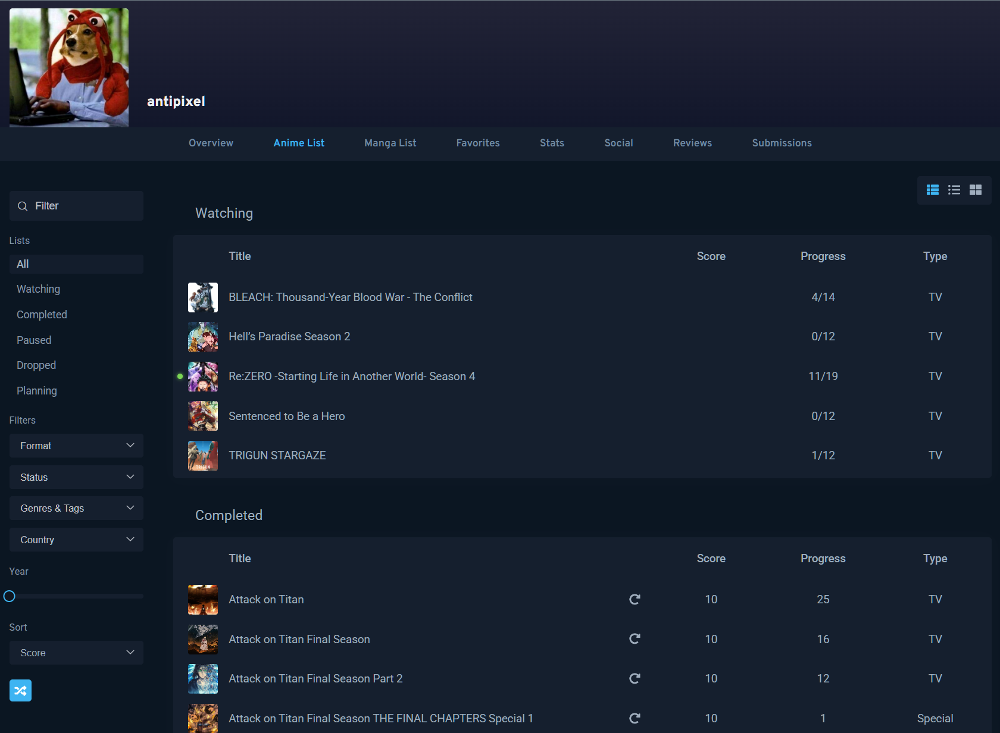

# UI references and interaction contract

User-provided AniList screenshots, saved 2026-09-18. These images are visual references, not instructions to implement every visible field or feature. Written decisions in PLAN.md take precedence.

## List row

See the full profile-list reference below for the surrounding page, navigation, filtering, sorting, and view controls. Combine that layout with this row-hover interaction.

Accepted: compact rows; hover exposes an ellipsis opening the quick editor; clicking the title opens title details. The image suggests a blue active/hover row, small cover thumbnail, and large cover preview beside the list. Preserve the clean navy/blue visual direction. Exact cover-preview behavior is a design proposal, not yet independently specified.

Proposed accessibility/mobile adaptation: expose the action on keyboard focus and provide a tappable row action on touch; no essential operation may depend on hover alone.

## Quick editor

Accepted interaction: ellipsis opens an editor instead of navigating away. Visual reference: wide banner header, overlapping cover, title, favorite toggle, clear Save action, dark form fields, and separated Delete action. Deleting a tracked entry must confirm its full personal-data removal and intended sync propagation.

Status, score, progress, optional editable start/finish dates, private notes, and rewatch count are in scope. Dates follow PLAN.md's status/observation rules; manual Completed defaults finish only, not start. Favorite, per-entry privacy, and custom lists are excluded from this editor. Zero input means unrated; never display zero as a score.

For a show in calculated rating mode, the editor must identify the value as calculated and provide an explicit mode change rather than silently overwriting season scores. Exact UI remains to be designed.

### Updated editor composition reference

This later user-supplied image sharpens the desired composition: a wide dimmed banner, cover overlapping the header/body boundary, title aligned with the cover, a quiet close icon, a strongly aligned multi-column field grid, dark inset controls, a compact primary Save action, and a visually separated destructive action. Media Tracker should reproduce that balance and spacing with its own fields. Omit the pictured favorite, Custom Lists, and Private controls. All popup/editor surfaces must support outside-click and Escape dismissal; if the form is dirty, ask before discarding and then close or return to editing.

## Title details

Accepted: clicking a list title opens this type of detail layout. Use a banner, prominent cover, status/favorite controls, title/synopsis, organized metadata, and social ratings. Translate anime-specific content to movie/TV data; the screenshot does not mandate anime characters/studios, every tab, or every distribution chart for release one.

Required adaptation: distinct IMDb and RT critic/audience scores where available; followed-users average and individual scores; seasons/progress and season rating controls for TV. Show only whole series in lists/search.

## Notifications versus activity feed

Notifications is a private sync-review surface, not the social feed. Explain the source change and local interpretation; offer confirm, alternate status, and rating. Apply inferred status locally and mirror underlying removal to Stremio/Nuvio immediately; hold propagation to other tracking platforms until confirmed. Auto-confirm is per user, off by default, for ordinary inferred status events only. Conflicts/uncertainty/initial merges/destructive deletion retain review. Changing back to Watching restores supported playback state on next sync. Completed takes priority; never treat initial empty accounts as removal events.

### Updated Notifications feedback

This is evidence of the current design problem, not a target to reproduce. The cards use too much repeated category/severity/status prose, weak spacing hierarchy, oversized action pills, and page-specific geometry. Replace them with a shared notification/card primitive whose variants retain consistent media, content, metadata, and action regions. Convey hierarchy primarily through spacing, alignment, weight, imagery, and restrained accents. Direct local edits do not appear here; only their queued delivery state may appear separately under pending connection updates.

## Navigation and shared profile lists

Accepted navigation: Home, Movie List, Series List, Browse, Profile; Settings contains connections/preferences. Movie/Series List links open the current user's profile list, not a separate owner-only list design. Owners and visitors see the same presentation; edit permissions and private notes remain owner-only. Render status groups one below another and support filtering by status. Home shows self/followed activity and the pending Notifications count. Streaming Library is an owner-only tab on the profile.

## Screenshot scope guard

Do not reintroduce custom lists, episode ratings, separate-season list rows, or entry-level privacy purely because AniList exposes similar options. Persist actual product decisions separately from visual inspiration.

## Full profile list, navigation, and filters

Added at the user's request as list-page, navigation, and filter inspiration. This supplies the page-level context for the earlier hover/editor screenshots.

- Wide profile header with avatar and username, followed by horizontal profile navigation and a clear active tab. Adapt Anime/Manga List to Movie/Series List; maintain the shared owner/visitor presentation and owner-only Library tab.
- Desktop left sidebar: list text search, All plus Watching/Completed/Paused/Dropped/Planning shortcuts, metadata filters, year control, and sort selector. Keep user tracking status distinct from a title's release/production status when adapting the screenshot's separate Status filter.
- Main content: vertically stacked status groups, each with a heading and a spacious dark table. The All selection shows the groups together; selecting a status filters the same list view.
- Rows show cover/title, score, progress, and relevant type information in aligned columns. Combine with ellipsis-on-hover quick editing and title-to-details navigation from the earlier reference. Unrated remains visually empty or labeled unrated, never a zero score.
- Upper-right view selector provides inspiration for compact-list/grid controls. Three icons in the screenshot do not require adding a third view beyond the already agreed modes.
- Use the screenshot's restrained navy surfaces, blue active controls, muted text, and generous separation between groups to guide hierarchy and density.
- Metadata filter inspiration: format/type, release status, genres/tags, country, and year; sorting includes score. Adapt labels/options to movie/TV metadata and actual provider coverage. These are visual/control references, not a promise of unsupported provider fields.
- On phones, move the sidebar controls into an accessible collapsible panel/drawer while retaining search, status selection, sorting, and view switching. Preserve useful title/score/progress information without requiring desktop-width tables.

Do not copy unrelated Reviews/Submissions tabs, the random/shuffle action, separate anime season entries, or rewatch automation into release one solely because they appear here. The accepted product specification still defines scope; this screenshot defines layout and interaction inspiration.

## Phase Two owner-review reference pass

The next implementation pass must inspect the live [AniList list](https://anilist.co/user/antipixel/animelist) and [AniList stats overview](https://anilist.co/user/antipixel/stats/anime/overview) with `agent-browser` before choosing replacement layout constants. Record the viewport, browser scaling, app-bar/profile/filter/list coordinates, row heights, font sizes/weights, and relevant gaps in the verification record.

For the list/profile comparison, scope the visual reference to the top desktop 16:9 viewport. Use its relative placement and rhythm for the logo, app bar, profile gradient/header, avatar, profile navigation, left filter rail, and compact rows. This is a targeted geometry and hierarchy pass, not permission to copy AniList branding, anime-only fields, or the full page.

For Stats, use the reference's icons, whitespace, alignment, typography and restrained separators to replace the current lifeless repeated-card feeling while preserving the already accepted metrics, filters, charts, privacy, and non-canvas text equivalents. Fast search likewise follows AniList's staged desktop composition: animate the input first, then reveal only nonempty category result cards together after the response. Fast search is not supported on phones in Phase Two; mobile discovery continues through Browse.

