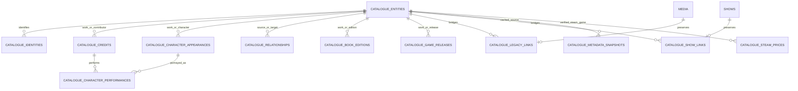

# People, organizations, characters, credits, and daily statistics

Date: 2026-10-09

Branch: `beta`

Status: catalogue/schema and server metadata foundation implemented on `beta` (2026-10-09). Statistics APIs, daily jobs/snapshots, frontend redesign, game/book tracking and board games remain deferred. The [implemented catalogue contract](catalogue-foundation.md) is authoritative for exact tables, routes, migration, provider verification, limits and terms; this document retains the future statistics design.

## 1. Recommended direction

Use a shared **Person** entity for real individual contributors, **Organization** for companies/brands/institutions, and a separate **Character** entity for fictional identities. Connect contributors to media through normalized credits and characters through scoped appearances. Keep streaming availability separate from creative/production credits. Calculate user statistics from those relations in a background job and publish a coherent snapshot approximately every 24 hours.

The same person can act in a movie, voice a game character, write a book, or design a board game. Those are roles on a credit, not separate kinds of person. A character needs its own identity and artwork because it can be portrayed by several people, have several language casts, or appear in a book without an actor at all.

The relations are necessary for the requested behavior. They also make querying efficient: indexed joins and shared identity records replace repeated scans of duplicated cast JSON. PostgreSQL is sufficient for this scope; neither a graph database nor Redis is required.

The foundation includes movie/series, game and book catalogue records with verified TMDB/TVDB, IGDB, Hardcover and RAWG adapters. IsThereAnyDeal is limited to Steam current prices and dated Steam store lows. Catalogue membership does not create watch, reading or play history. Missing character art remains null.

## 2. What the new screenshots add

The new references show two useful patterns:

- **Genres:** a Count / Mean Score / Time Watched selector; each ranked genre displays all three values and a strip of connected title posters.
- **Voice Actors:** a titles/characters selector plus the same metric selector; each ranked person has a portrait, three metrics, and connected title posters.

In these screenshots the selected metric appears to determine ranking while all three metrics remain visible. Our implementation should use that behavior: sorting should not remove the other useful values or require recalculation.

Adopt the information structure, cyan selection, navy surfaces, portraits, and related artwork. Retain the earlier dense/minimal/no-cards requirement: use aligned sections with space, not oversized boxed entries. Genre headings sit above a compact three-value row and a poster strip. Person rows use a modest portrait beside the name and metrics, followed by the related artwork strip. Use a quiet rank number rather than a decorative badge.

On mobile, keep the selectors at the top and allow the poster strip to scroll locally without causing page overflow. On desktop, use more horizontal alignment, not larger portraits. Hover/focus may reveal title names and precise values. Related posters must be links with useful accessible names.

For our movies-and-series application, label the first person view **Titles**, rather than Anime. A future **Characters** view uses actual character identity/artwork where available. Generic acting and voice acting are distinct credit-role filters; dubbing language is meaningful only when supplied by the source.

## 3. Existing person support that must be preserved

There is already a `person` value in [`MediaType`](../backend/models/base.py). People can be stored as `Media` rows for lists and Trakt imports, using a name as the title and a portrait as the poster. Relevant consumers include:

- [`lists.py`](../backend/routers/lists.py): adding a person to a list.
- [`trakt_sync.py`](../backend/core/trakt_sync.py): importing list people.
- [`media_discovery.py`](../backend/routers/media_discovery.py): person detail and list membership lookup.
- [`media.py`](../backend/routers/media.py): people search/discovery responses.

This is not yet a reusable normalized person/credit model. Do not immediately remove `MediaType.person` or change existing list item IDs. Introduce canonical people and bridge legacy person media rows to them; preserve existing routes and imports while migrating their readers/writers deliberately.

Existing [`TitleCredits`](../backend/models/title_credits.py) and media cast JSON are useful migration inputs and provider snapshots. After cutover, the canonical people/credit relations become the statistics read source. Do not maintain two independent competing actor identity systems.

## 4. Implemented domain model

Migration `mt036` creates 13 additive tables, including provider request budgets. A checked, immutable root kind distinguishes works, people, organizations, characters, editions and releases. Namespace-qualified identities are unique and FK-backed. PostgreSQL validates contributor/character kinds, edition parents, same-work performance links, typed relationships and verified Steam prices. ISBNs identify editions; platform variants are releases; DLC/expansions/remakes are linked distinct works.

The earlier conceptual names below describe domain semantics; the executable model is the shared `catalogue_entities` root and tables above. Distribution services/availability and daily statistics storage remain future work. Existing regional browse filters remain the streaming catalogue path.

### People and identity

| Table | Core fields and constraints | Purpose |
| --- | --- | --- |
| `people` | Local primary key, display name, nullable portrait reference, small source/metadata fields, timestamps | One reusable individual, independent of their jobs |
| `person_external_ids` | `person_id` FK, provider, external ID as text; unique `(provider, external_id)`; index `person_id` | TMDB, TVDB, and future provider identities for that individual |
| `legacy_person_media_links` | `media_id` FK/primary key, `person_id` FK/index | Preserve existing list/import person rows, including legacy aliases |

Use text for external IDs: future book/game providers may use strings, URLs, or identifiers that are not integers. If a provider has multiple person namespaces, include its namespace in the uniqueness key.

Do not put an `actor/developer/writer` enum on Person as its authoritative type. Roles belong to each media credit. Do not merge people by name or portrait similarity. Link multiple provider identities only through verified cross-references or an explicit reviewed merge. Keep provenance for merges and a way to correct a mistaken link.

A development studio, publisher, or production company uses the shared Organization model described below. Keep typed person and organization credit relations with actual foreign keys, while reusing the role vocabulary where appropriate.

### Credits and role vocabulary

| Table | Core fields and constraints | Purpose |
| --- | --- | --- |
| `credit_roles` | Stable role code/primary key, label, role family | Extensible vocabulary such as actor, voice_actor, director, writer, author, illustrator, programmer, game_designer, translator |
| `media_credits` | Local primary key; `media_id` and `person_id` FKs; role-code FK; language code; billing order; credited-as name; source/scope fields | A person's contribution to a particular media item |
| `credit_characters` | Credit FK, media-character FK; unique pair; media-scope consistency enforced | One credit can portray several characters; one character can have several performers |

Recommend canonical credit uniqueness on `(media_id, person_id, role_code, language_code)`. Store a known language code or `und` for unspecified language; do not infer a dub language from a person's nationality or a title's original language. Keep original source job labels/credit identifiers in provenance so normalization does not discard information.

Multiple source records for the same canonical contribution should enrich its provenance, not create duplicate counted credits. The cast provider's credit ID identifies a **credit**, not necessarily a person or fictional character. Verify each provider's identifier meaning before storing it in the corresponding identity table.

For people with multiple acting roles or characters in one title, title-based actor stats count that title once. A writer/director credit must not put the person into the actor ranking unless they also have an acting credit.

### Characters and appearances

| Table | Core fields and constraints | Purpose |
| --- | --- | --- |
| `characters` | Local primary key, display name, nullable default artwork reference, identity scope/provenance, optional descriptive metadata | A fictional identity independently of its performer |
| `character_external_ids` | Character FK, provider, external ID as text; unique provider/namespace identity; index character FK | Trusted fictional-character identifiers where providers offer them |
| `media_characters` | Local primary key; media FK and character FK; unique `(media_id, character_id)`; display/role label, nullable artwork override, source/scope | A character's appearance in a work, including adaptation-specific artwork |

Keep a default image on Character and permit an artwork override on its media appearance. A novel illustration, game portrait, and movie adaptation should not overwrite one another. Store image source/provider and attribution/license data where supplied. A full image-gallery table can be added when multiple artworks per context are actually needed.

The absence of a portrait or character art remains null with a neutral UI fallback. An actor portrait is not character artwork. Do not silently present a cast member's photograph as a fictional character.

Character identity across adaptations/continuities requires evidence. Two people named “Batman” in different versions are not automatically one globally merged character. Use source-qualified identities or explicitly media-scoped local characters until a trustworthy canonical link exists.

Current TMDB credits often supply only a role string. Preserve it on the credit even when no trusted Character record exists. A local, media-scoped character can be curated from that evidence, but an unstructured role such as “Guard,” “Self,” or “Bruce Wayne / Batman” must not automatically become a globally deduplicated entity. Splitting role strings is not a reliable identity resolver.

Enforce that `credit_characters` connects a credit and character appearance in the **same media scope**. Composite FKs with the scope's `media_id`, or an equivalent database-enforced constraint, can prevent linking a movie actor to an unrelated game's character. If later episode-level credits are added, attach the corresponding episode appearance in that scope and retain its series parent relationship separately.

### Organizations and their contributions

An Organization is a reusable public identity for a company, brand, studio, publisher, or broadcaster. It is not a legal ownership registry. One organization can perform several roles across media, so avoid a single exclusive `studio/publisher/network` enum that forces duplicate identities.

| Table | Core fields and constraints | Purpose |
| --- | --- | --- |
| `organizations` | Local primary key, display name, nullable logo/homepage, descriptive source metadata, timestamps | Shared studio/publisher/network identity |
| `organization_external_ids` | Organization FK, provider, **namespace**, external ID as text; unique `(provider, namespace, external_id)` | Distinguish company IDs, network IDs, and future publisher/provider identifiers |
| `media_organization_credits` | Media FK, organization FK, role-code FK, provenance/scope; unique canonical media/organization/role contribution | Production studio, publisher, distributor, development studio, broadcast network, etc. |

Roles belong to the media relationship. For example, an organization can be a production company on one title and a distributor on another. A game developer company uses a development-studio role; its individual developers use Person credits.

Keep the person credit table and organization credit table explicitly typed, using the common role catalogue with contributor applicability. Each reader must validate the allowed role family. Do not replace real FKs with a generic `contributor_type + contributor_id` pointer. A shared contributor read projection is possible without a universal entity table.

**External-ID namespaces are essential:** TMDB company ID 100, network ID 100, and watch-provider ID 100 are different identity spaces. Matching the numbers, names, or logos does not establish one organization. Link cross-namespace identities only through verified source evidence or reviewed mapping. A service brand and its parent company may legitimately remain separate identities.

Default organization-to-media lookups need only one indexed credit join. Group by canonical media ID to deduplicate a title where the organization has several roles. Studio/network metadata does not prove an entire streaming catalogue, and an organization producing a title does not establish where it is currently available.

No parent-company hierarchy, acquisition history, licensing-contract model, or general organization-to-organization graph is required to show a studio's credits or a service's current title list. Add a verified parent/brand relationship later only for a real feature. Do not automatically include all subsidiaries when filtering one organization.

### Streaming services: a distinct availability relationship

Streaming-service support is useful for the requested catalogue list, but its relationship is **availability**, not a creative credit. Availability varies by country and access type, and changes independently of who made the show.

A company can operate multiple offerings: subscription, ad-supported, or channel/add-on variants. Preserve each provider's service identity so a user can select the exact offering. A verified Organization link can group those services on an organization page later; a shared parent must not silently merge their subscriptions/catalogues.

If local indexed availability becomes useful, use this small optional extension:

| Table | Core fields and constraints | Purpose |
| --- | --- | --- |
| `distribution_services` | Local primary key, display name, logo, nullable organization FK | User-selectable service/product, with optional verified organization affiliation |
| `distribution_service_external_ids` | Service FK, provider, namespace, external ID; unique source identity | Preserve service IDs and reconcile future metadata sources |
| `media_availability` | Media FK, service FK, country code, offer type, source identity, observed/fetched time, optional source listing URL | Indexed current observed title availability |

Canonical membership is `(media_id, service_id, country_code, offer_type)`. If multiple sources are retained, include source in the stored observation's uniqueness and reconcile/deduplicate those observations in the read projection. Country codes should be validated; offer type should retain source distinctions such as subscription (`flatrate`), free, ads, rent, and buy.

Do not invent a licensing start/end date from a fetch timestamp. An observation time establishes when we checked, not when availability began. A provider's regional listing link may be a discovery/aggregator URL; label it accordingly rather than claiming it is a direct playback link.

For a service page, filter service + country + selected offer type, and return distinct media. Subscription should be a clear option; rental-only titles should not unexpectedly enter its subscription list. A title-level TV listing does not establish that every season/episode is available; represent finer scope only if a source supplies it.

**Freshness and replacement:** retain fetch status/freshness per source, media item, and covered region scope, including successful empty results. On a successful complete response for that scope, replace its previous memberships, including removing titles/services no longer present. Failed or partial responses retain last-good data and do not establish absence. Omitted country keys must not be treated as authoritative removal without a defined provider completeness contract. A service catalogue page and a single-title provider response have different coverage scopes.

The availability state is shared metadata; it must not be recomputed per user, duplicated into twenty user snapshots, or fetched inside the daily statistics transaction. Its refresh schedule is independent. Region-filtered browse results can have a short cache, while provider title metadata uses its own per-title freshness policy.

### Existing streaming support and the lean first step

The source audit establishes that a basic service catalogue needs no new availability schema:

- [`browse.metadata_fields`](../backend/core/browse.py) retains `watch/providers.results` in `Media.tmdb_data.watch_providers` through movie/series enrichment.
- Existing [`GET /tracking/browse`](../backend/routers/tracking.py) accepts `provider`, `region`, `media_type`, pagination, and local/remote source selection.
- Remote discovery already sends `with_watch_providers`, `watch_region`, and `with_watch_monetization_types=flatrate|free|ads`.
- Local filtering reads regional provider arrays for those same three access types.
- `local_providers()` scans retained provider JSON to build a fallback selector. This is a working fallback, not an indexed organization identity model.

For a provider's broader catalogue, use remote discovery with the chosen provider ID and region. The local database covers retained titles only and cannot establish all shows on a service. Provider results also have their own coverage and pagination limits. Preserve media visibility rules; remove the default minimum-vote threshold only if the intended catalogue should include low-vote titles.

Current filtering combines subscription/free/ad-supported availability and does not offer rental/purchase selection. An exact subscription-only view requires an explicit access-type filter, consistently passed to remote discovery and local matching. It does not require a corporate relationship graph.

Shared metadata writers must preserve watch-provider fields across show/series refreshes: some Show projections do not currently retain them, and `enrich_series_from_show()` can replace the media snapshot. The earlier shared-writer fix applies to streaming metadata too. Do not claim the cached local service membership is complete or reliably fresh until that retention and coverage audit is done.

**Recommended scope:** plan Organization identities and production/publishing/network credits as part of the reusable contributor schema. Reuse the existing regional provider-discovery path for service lists first. Add normalized service/availability tables when we need efficient local/offline catalogue queries, richer organization/service pages, or reliable shared availability caching. This avoids importing an entire streaming catalogue solely to render a paginated service list.

## 5. Connecting catalogue works to existing tracking

Credits reference canonical work and contributor IDs with real FKs. Existing `Media`/`Show` rows connect through `catalogue_legacy_links`/`catalogue_show_links`; their IDs, person lists, watch history, ratings, progress and TVDB episode numbering stay intact. Resumable admin backfills use verified provider IDs and cached credits; names never establish identity.

Future statistics join tracked IDs through these bridges and deduplicate contributor/work pairs. `MediaType` remains unchanged. Game/book search, metadata, editions and releases are catalogue data; reading/play sessions, progress, scoring and tracking routes require a later domain contract. Translators/narrators can retain an edition FK; work contributors remain work-scoped.

## 6. Efficient queries and indexes

Initial index/constraint candidates:

- Unique provider identity lookups on person/character external-ID tables.
- `media_credits(media_id, role_code, person_id)` for a selected user's watched-title set.
- `media_credits(person_id, role_code, media_id)` for person detail/drill-down.
- Unique canonical credit identity, including specified/unspecified language handling.
- Unique `media_characters(media_id, character_id)` plus reverse `(character_id, media_id)` access.
- Unique performance link pairs plus an index in the reverse direction.
- Unique organization external identities, including namespace; organization credit indexes in media-to-organization and organization-to-media directions.
- If availability is normalized later: `(service_id, country_code, offer_type, media_id)` for service catalogue membership and a reverse media lookup; reuse existing unique indexes where possible.
- Existing user/media and completed/watch-date indexes on watch events.
- Snapshot/ranking indexes described below, only for actual supported sort/filter combinations.

Measure query plans before adding redundant indexes: composite unique indexes can already cover some of these lookups. FK definitions do not automatically create every useful referencing-column index in PostgreSQL.

Build one per-user canonical title fact set first: distinct title ID, movie/series kind, completed minutes, current effective score, and date/coverage information. Then join those title facts to **distinct `(person_id, media_id)`** acting memberships, or distinct genre memberships. Do not join raw episodes directly to multiple credit-character rows: that multiplies runtime, counts, and scores.

Example: two roles, three characters, and twenty watched episodes for one actor still produce **one title**, the title's watched hours once, and its current personal score once. Character count is calculated separately from trusted distinct character identities, not by multiplying title metrics by performance links.

Use bulk upserts and batched reads. A page of twenty people must not issue twenty person requests and eighty individual poster queries. Fetch relevant people/media IDs in bounded queries, and use the shared image cache for reusable artwork.

## 7. A 24-hour statistics policy

The proposed cadence is a sensible default. At twenty users, the main issue is avoiding repeated work on every page load, not creating a distributed analytics platform. Keep the design small and database-backed while leaving a path for a separate worker at higher volume.

### Recommended behavior

1. Each user's job builds **Overview, Genres, and People metrics together**, for All/Movies/Series, from one consistent local-data snapshot.
2. Schedule ordinary successful updates roughly 24 hours apart per user. Stagger due times across users rather than recomputing everyone at midnight.
3. Ordinary history/score/status/import changes increment a per-user source revision and mark stats dirty in the same transaction as the committed facts. Coalesce a large import's writes into batch-level revisions where possible; an import that commits partially must still invalidate those committed changes even if its final step fails. Do not launch calculations for every changed episode or each profile visit.
4. A scheduler checks due work periodically, for example every five minutes, and uses database coordination to claim jobs. Process a small configurable number concurrently.
5. Skip a due calculation if neither user facts nor relevant shared metadata changed and the contract/version is current. Advance its check schedule without pretending the old data was newly computed.
6. Publish the new snapshot atomically only after all its sections succeed. Requests continue to read the last successful snapshot during work.
7. The page can expose one compact “Updated …” value in its options/data details, rather than repeated freshness text for every chart.
8. On failure, keep the previous successful snapshot, record the error safely, and retry with backoff. A failed attempt does not reset the successful-update timestamp.

Twenty changed users would ordinarily mean about **twenty snapshot jobs per day**, not twenty jobs per visitor or twenty times the number of graphs. That is a scheduling target, not a benchmark or guaranteed upper bound: first builds, failures, contract changes, and exceptional invalidations can require additional attempts.

The 24-hour interval is a target freshness window plus scheduler/queue time, not a guarantee that an offline worker can meet it. Record overdue work and successful computation times. Small deployments can use the existing application scheduler with PostgreSQL leases/advisory locking; multiple app workers must not each run the same user's calculation. Process-local booleans alone are insufficient.

### Important exceptions

- **First build:** queue once immediately. Return a compact pending state if no successful snapshot exists; do not fabricate zero statistics or block a public request on provider fetches.
- **Privacy/access changes:** take effect immediately. Authenticate and enforce current profile visibility before returning any stored snapshot. Cached profile access is not a 24-hour permission grant.
- **User deletion:** delete their state, snapshots, and user-specific aggregates through appropriate cascade behavior.
- **Sensitive history removal or explicit purge:** invalidate affected snapshots immediately and queue replacement; a cached poster strip must not keep disclosing removed history for another day. Other ordinary edits can follow the chosen daily policy.
- **Contract/schema change:** invalidate incompatible builds and queue compatible snapshots; do not deserialize an old shape as current data.

Ordinary listing/detail/status edits elsewhere in the application should remain live. This cadence is for the statistics pages, not a reason to make all profile/tracking controls stale.

### Why a TTL alone is insufficient

“Recalculate on the first request after 24 hours” moves expensive work into a profile visit and can cause simultaneous duplicate builds. A plain in-memory cache disappears on restart and does not coordinate multiple workers. A scheduled persistent snapshot avoids both problems.

Dirty state should remain set when facts change during an ongoing build. Read a consistent database snapshot, capture its revision, and publish its computed data with that revision. Clear dirty state only if the current revision still matches; otherwise retain the pending change for the next scheduled pass. Do not lose concurrent updates by blindly writing `dirty=false`.

Use a dedicated worker connection/session for consistent snapshot reads; avoid keeping locks on history-writing rows throughout calculation. There must be no external provider calls inside the statistics transaction.

Audit every writer, including manual edits, provider syncs, webhooks, bulk updates, and deletions. A shared mutation service or database-assisted revision mechanism must cover them; ORM callbacks alone may miss direct/bulk SQL. Tests should establish that each committed fact change is visible to the refresh state without forcing immediate recalculation.

## 8. Proposed statistics storage

These tables cache derived results. Watch events, tracked scores/statuses, and normalized shared metadata remain authoritative.

| Table | Proposed contents | Purpose |
| --- | --- | --- |
| `user_stats_state` | User PK/FK, current source revision, dirty/invalid state, next due time, retry/attempt fields, job lease token/expiry, active snapshot ID | Durable scheduling and one active published generation |
| `user_stats_snapshots` | Snapshot PK, user FK, computed/source-cutoff time, captured user/metadata revisions, contract version, overview JSON for supported media scopes, coverage and privacy-sensitive validity state | Coherent last-successful overview and generation identity |
| `user_person_stats` | Snapshot FK, media scope, supported acting-role scope, person FK, title count, minutes, score sum/count, trusted character count/coverage, bounded preview media/character IDs | Indexed, paginated actor/voice-actor rankings without scanning full history |
| `user_genre_stats` | Snapshot FK, media scope, stable normalized genre key, title count, minutes, score sum/count, bounded preview media IDs | Genre ranking and associated poster previews |

Use uniqueness on the snapshot plus each row's grouping dimensions. Add ranking indexes matching Count / Mean Score / Time Watched only where measured and useful. Define null-score ordering and stable tie-breaking by canonical ID. Character count uses its own distinct identity denominator.

Enforce that a state's active snapshot belongs to the same user, for example with an owner-qualified composite foreign key. User-specific snapshot/aggregate rows need an explicit deletion/cleanup policy. Shared canonical person/character records must not be casually deleted while legacy lists or published aggregates still reference them; merge identities through a controlled relation rewrite.

Keep additive score components so means can be calculated accurately; do not average rounded per-title-group means. Snapshot overview can include score sum/squared sum/count for standard deviation. Retain precision until formatting.

The initial poster strip contains a bounded set, for example four related media IDs, chosen consistently from the same generation. Artwork URLs/names can be read in a bulk query from shared metadata; dimensions/links do not require provider calls. Do not duplicate full biography/cast/history payloads into every user's cache.

For full title/character drill-downs, define a same-generation membership representation before implementation: a snapshot membership table or retained member IDs with supporting snapshot title facts. Do not display a frozen count of 22 alongside a live, differently filtered list of 19 titles. Start with the bounded previews if full drill-down persistence would expand the first release unnecessarily.

A snapshot membership table should enforce an actual person/genre grouping reference and media FK rather than unconstrained arbitrary entity pointers. If all related IDs are temporarily kept in JSON for the small instance, document that compromise, enforce payload limits, and measure pagination cost before treating it as the long-term solution.

Build each new generation in staging, then update the user's active pointer in a short transaction. Old successful generation remains available until publication; clean up superseded generations after they are no longer referenced. First-generation failure leaves a pending/error state, not a half-published page.

Lease claims must include an ownership token and expiry so a crashed worker can be retried and a late worker cannot publish after losing its claim. Consistent per-user claim ordering and short transactions avoid blocking user activity. A simpler connection-owned PostgreSQL advisory lock is also possible, but must be used on a dedicated connection for the full job and released reliably.

Cache dimensions must include media scope, supported acting-role/language scope, visibility policy, and contract version. Avoid arbitrary parameter combinations creating infinite cached variants. The initial UI supports a small documented set. Recheck live profile access on every request regardless of snapshot age.

## 9. Keep metadata refresh separate from stats refresh

Shared people, organizations, credits, countries, availability, and artwork are provider metadata. A user's watched/rated totals are local derived facts. They need separate schedules:

- Deduplicate metadata targets across users and fetch missing/stale/version-old media/people once per provider identity.
- Use per-title/provider completion and retry state. Mark a successful empty result separately from “not fetched” or “failed.”
- Keep last-good metadata when a provider request fails. Record batch source/revision changes after a successful committed update.
- Mark users whose tracked/watched titles intersect changed metadata as dirty. For the small instance, a simple batch invalidation is acceptable; an indexed affected-user lookup avoids marking everyone as the library grows.
- Do not re-fetch every credit/person every 24 hours simply because user stats refresh daily. Cadence depends on metadata type and airing/credit stability; missing data should be fetched promptly, stable images and credits can have a longer TTL.
- Resolve new people from title-credit payloads first; biography/image-gallery requests should be lazy or separately batched when actually needed.

The existing [`scheduler.py`](../backend/core/scheduler.py) already registers background jobs and contains a daily show metadata sweep. It is an integration point, not evidence that a durable statistics scheduler or normalized person cache already exists. Add explicit multi-worker coordination for the new tasks.

## 10. Verified provider coverage

The [provider evidence table](catalogue-foundation.md#provider-evidence-and-limitations) records current official documentation, independently checked live responses and terms. TMDB movie and TV aggregate credits preserve supplied roles/jobs and people; TVDB retains `peopleId`, portraits and association labels. Their credit association IDs are not global fictional character IDs.

IGDB supplies game works, companies, releases, collections/related-game links, Steam mappings and independent characters/art when available. Hardcover supplies works, canonical aliases, editions/ISBNs/publishers, work/edition contributors, series and characters; sample character image IDs were null. RAWG is lower-priority fallback, with distinct developer/publisher namespaces and exact Steam links. ITAD stores only Steam shop 61 current and dated store-low results, explicit country and unchanged provider URLs.

No adapter establishes complete language-specific voice casting, game staff, anime character coverage, reading/gameplay duration or board games. Statistics character cohorts require actual identified appearances and deduplicated works; role text and actor portraits cannot substitute for character identity/art.

## 11. Statistics delivery sequence (remaining phase two)

The catalogue migration, adapters, authenticated endpoints and resumable legacy bridge are implemented. The original roadmap below is retained: steps 3–5 are now foundation capabilities, while statistics readers, jobs and frontend remain outstanding. See the foundation document for delivery evidence.

1. Confirm the semantic boundaries in this document: real people, separate characters, contribution roles, title-level actor hours, and scheduled statistics.
2. Audit live data for person media rows, title aliases, existing credits, stable external identities, role labels, portraits, and usable character identities/artwork. This is still a required read-only operational step.
3. Completed: canonical work/person/organization identities, typed credits, characters, editions/releases and legacy bridges use additive `mt036`. Nullable art retains actual provider availability. Normalized streaming availability remains optional.
4. Backfill TMDB people from `TitleCredits` IDs, bridge legacy person media rows by verified IDs, and map credits to canonical title media. Legacy media cast without IDs cannot be globally deduplicated by name alone.
5. Extend provider adapters to retain complete source-appropriate credits, role labels, portraits, language where known, and trusted character associations. Refresh discarded metadata only through controlled provider calls.
6. Treat existing `TitleCredits` as an ingestion/compatibility snapshot during transition. Move statistics readers to normalized relations; later retire obsolete aggregation/write paths. A provider-aware ingestion state extension may still be useful, but its JSON is not a second canonical person database.
7. Add state/snapshot/ranking tables and scheduled computation. Test job claims, revision races, failure/restart recovery, atomic publication, privacy, and purge invalidation before exposing cached data.
8. Build the overview and ranked genre/person sections against the stored snapshot contract. Use fixture-only characters for a clearly labeled design prototype if provider character/art coverage is missing; do not present those fixtures as user data.
9. Foundation completed: isolated migrations and beta forward deployment passed. Future statistics migrations should follow the same backup/deployment path. Production promotion is outside this phase.

For approximately twenty users, start with bounded jobs and PostgreSQL indexing. Measure job duration, rows scanned, ranking latency, snapshot size, due-work backlog, provider request volume, and coverage. More infrastructure is justified by those measurements, not by speculative scale.

## 12. Remaining scope and operational boundaries

The goal authorizes beta catalogue implementation, push, private provider defaults and forward migration via Preview Deploy. Defaults use the reviewed bootstrap helper and server environment, never database seeds or browser responses. Live local provider checks have succeeded; the foundation document records deployment validation.

Statistics APIs/jobs/frontend, game/book tracking, board games and production promotion are outside this phase. Live user-data coverage auditing remains separate from representative provider checks.

No need to request broad database privileges for daily statistics readers. Deployment uses the existing migration role; application workers need the ordinary read/write rights for their own new tables. A coverage audit should use permitted read-only access. Image-host/network grants are separate from metadata API credentials.

Recommended defaults:

- Person means an individual; Organization is a shared company/brand/institution identity with media-specific production/publishing/network roles.
- Streaming service membership uses regional availability, independently of contribution credits. Reuse existing provider discovery before adding a local availability index.
- Characters are separate and may be source-qualified/media-scoped until verified canonical links exist.
- Credits, role vocabulary, and performance links are normalized now; unavailable artwork remains null.
- Overview/Genres/Actors snapshots refresh together on a staggered approximately 24-hour cadence.
- Actor hours mean hours in credited titles, not screen time.
- Preserve legacy person-list links and movie/series history through migration.
- Implement future media catalogue/progress/APIs separately; reuse these contribution/character boundaries.

The recommended architecture is a shared normalized person/organization contributor model, separate characters and performance links, and a persistent statistics cache. Streaming catalogue support can begin with existing provider discovery and evolve into normalized observed availability when needed. This does not claim missing metadata or future API access has already been obtained.

## Catalogue completion audit

The completed foundation was audited again on 2026-10-09. Additive `mt037` strengthens Steam identity, edition/work and concurrent performer-link integrity. Partial relation data and placeholder names preserve known metadata; provider downloads/cache sizes and durable error/retry state are bounded. See [catalogue-foundation.md](catalogue-foundation.md#goal-completion-audit-2026-10-09) for tests and delivery evidence. Statistics/UI and game/book tracking remain deferred.

Open Library now complements Hardcover in the catalogue foundation: default book search/ISBN matching, bibliographic enrichment and reading availability use Open Library; Hardcover retains structured characters, series and edition contributors. Verified edition identifiers join works; names do not. See [the integration contract](catalogue-foundation.md#open-library-integration-2026-10-09). Book tracking and statistics remain deferred.
